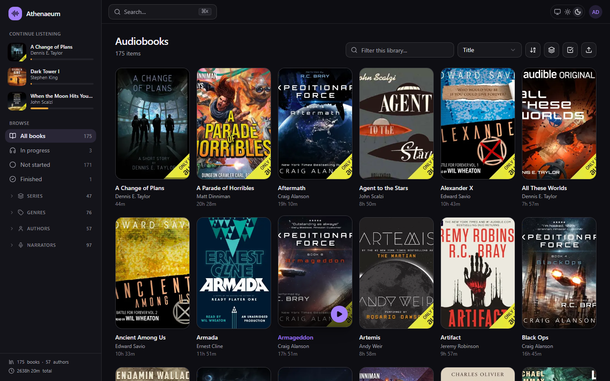
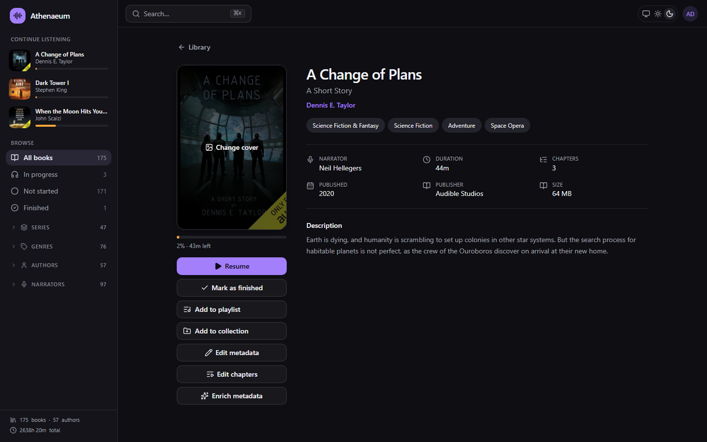
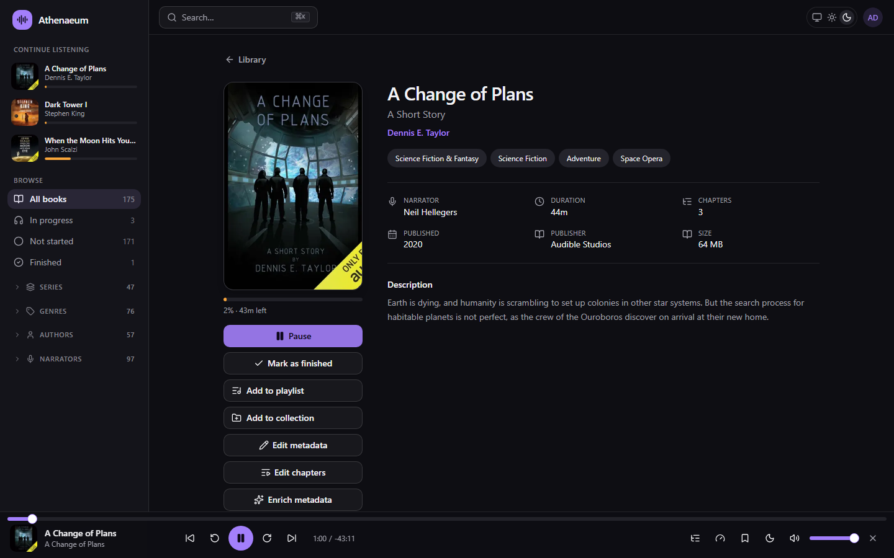
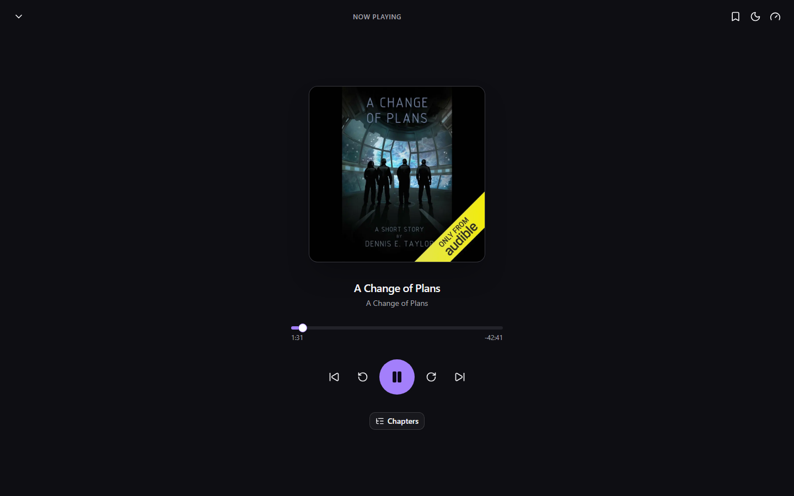
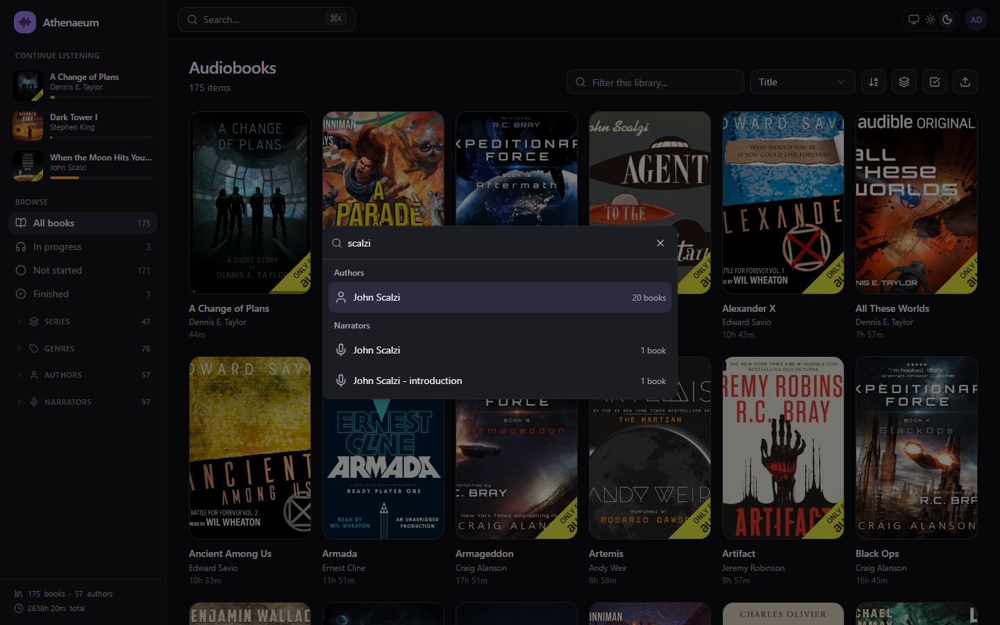
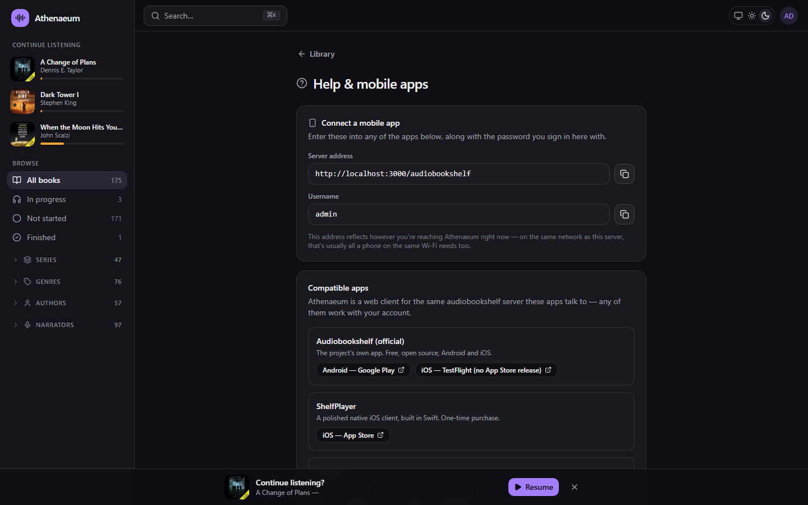
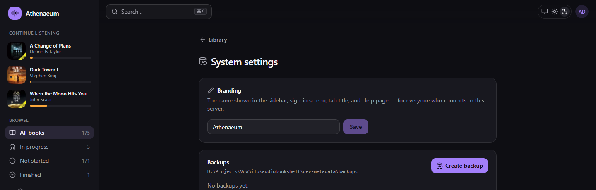

# Athenaeum

A modern, self-hosted audiobook player. Athenaeum keeps [audiobookshelf](https://github.com/advplyr/audiobookshelf)'s battle-tested server — the same Express/Sequelize/Socket.IO backend, the same HTTP API the official app and third-party clients (ShelfPlayer, Absorb, SoundLeaf) already speak — and replaces its Nuxt 2 client with a React 19 SPA built on Tailwind CSS v4, shadcn/ui, and Kibo UI.



## Contents

- [Screenshots](#screenshots)
- [Features](#features)
- [Stack](#stack)
- [Layout](#layout)
- [Running locally](#running-locally)
- [Configuration](#configuration)
- [Building](#building)
- [Testing](#testing)
- [How it works](#how-it-works)
- [Kibo UI](#kibo-ui)
- [Design tokens](#design-tokens)
- [Known gaps](#known-gaps)
- [License](#license)

## Screenshots

<table>
<tr>
<td width="50%"><br><sub>Item detail — metadata, chapters, and every action in one place</sub></td>
<td width="50%"><br><sub>A persistent player bar that survives navigation across the app</sub></td>
</tr>
<tr>
<td width="50%"><br><sub>Full-screen Now Playing, opened from the player bar</sub></td>
<td width="50%"><br><sub>⌘K search across titles, authors, narrators, and series</sub></td>
</tr>
<tr>
<td width="50%"><br><sub>Dynamic connection info for compatible mobile apps</sub></td>
<td width="50%"><br><sub>Runtime-configurable branding — no rebuild required</sub></td>
</tr>
</table>

## Features

- **Library browsing** — infinite-scroll grid, sort, in-library search, URL-driven filters, series grouping with reading order, collapsible sidebar filters for genres/authors/narrators
- **Player** — persistent bar plus a full-screen Now Playing view, chapter navigation, variable speed, configurable skip amounts, keyboard shortcuts, OS media-key integration, a sleep timer, bookmarks, and an "Up next" prompt for the next book in a series
- **Real search** — ⌘K command palette backed by the server's own search, not a client-side jump list
- **Metadata tools** — a full item editor, a chapter editor, a cover picker across seven providers, and enrichment from Audible/Google Books/Open Library/iTunes reviewed field by field before anything is written
- **Bulk actions** — multi-select on the library grid for collection/playlist add, finished/unread, bulk tag/genre edits, and delete, all in one action across many books
- **Collections & playlists** — shared admin-curated shelves and personal per-user playlists, both drag-to-reorder
- **Admin surface** — library settings (folders, metadata precedence, scan status), user management, backups & logs, and an admin-configurable app name — all without `ssh` or `curl`
- **Listening stats** — total time, a 14-day activity chart, day-of-week breakdown, and recent sessions
- **Help & mobile app setup** — dynamic server address / username, and links to every compatible mobile client
- **Runtime branding** — rename the app from Settings → System, no rebuild needed; see [Configuration](#configuration)

The sidebar deliberately has no library switcher — Athenaeum is single-library by design, so that space goes to filters and listening state instead. Podcasts, the ebook/comic reader, public share links, and RSS/email delivery are out of scope by decision; the server still supports all of it for other clients. Full history, scope decisions, and known bugs are tracked in [`docs/PLAN.md`](docs/PLAN.md).

## Stack

| Concern | Choice |
| --- | --- |
| Framework | React 19 + TypeScript 5.9 |
| Build | Vite 7 (SPA) |
| Styling | Tailwind CSS v4 (CSS-first, no config file) |
| Components | shadcn/ui (new-york, CSS variables) + Kibo UI |
| Server state | TanStack Query v5 |
| Client state | Zustand |
| Routing | React Router 7 |

Vite rather than Next.js is deliberate: audiobookshelf ships as a single self-hosted Express process that serves the client statically from `client/dist`. A SPA drops into that model unchanged, so the Docker image and single-binary packaging keep working.

## Layout

```
Athenaeum/
├── LICENSE                    GPL-3.0, inherited from upstream audiobookshelf
├── .mcp.json                  Kibo UI MCP server (project-scoped)
├── docs/
│   ├── PLAN.md                 Roadmap — what's built, what's left, in what order
│   └── screenshots/             Images used in this README
├── media/audiobooks/           Local dev library — drop Libation output here (see its README)
├── scripts/                    libation-to-abs.mjs — sidecar → abs metadata.json
├── services/openlibrary-provider/  Metadata enrichment service (see its README)
└── audiobookshelf/             The fork
    ├── server/                 Upstream Express server — unmodified except one additive
    │                           settings field (see Configuration) and static-serving routes
    ├── client/                 React + Vite client
    └── dev.js                  Local dev config (gitignored)
```

`audiobookshelf/` started as a separate clone of upstream on its own branch and has since been folded into this repo as a normal directory, so the whole project lives in one place and one history. It began as a shallow, single-commit clone, so no meaningful git history was lost in the flattening. To check for upstream changes, diff against a fresh clone of `advplyr/audiobookshelf` rather than `git pull` — there is no longer a tracking remote for it.

## Running locally

Two processes. The server first:

```bash
cd audiobookshelf && node index.js --dev
```

Then the client, which proxies API/socket traffic to it:

```bash
cd audiobookshelf/client && npm run dev
```

The app is at <http://localhost:3000/audiobookshelf>. The server listens on `:3333`.

On a fresh database, create the root user before signing in:

```bash
curl -X POST http://localhost:3333/audiobookshelf/init -H "Content-Type: application/json" -d '{"newRoot":{"username":"admin","password":"CHANGE_ME"}}'
```

## Configuration

### Base path

The server mounts everything under `ROUTER_BASE_PATH` (default `/audiobookshelf`), so Vite's `base` is set to match and `import.meta.env.BASE_URL` is the single source of truth in `src/lib/config.ts`. Change one and you must change the other.

### Renaming the app

"Athenaeum" isn't load-bearing anywhere. There are two layers, and most deployers only need the first:

- **Runtime, admin-configurable (no rebuild):** sign in as an admin and set it under Settings → System → Branding. This PATCHes the server's own `/api/settings` and persists in its database, so it's visible to every browser that connects to this server — not just yours. This is the one deliberate exception to "the server is never touched" below: `server/objects/settings/ServerSettings.js` gained one additive field, `customAppName` (constructor default, load-from-db, and `toJSON()`), so it round-trips through the existing admin-settings endpoint like any other server setting (`authLoginCustomMessage` is the precedent this follows). No existing field or endpoint behavior changed.
- **Build-time default (no server, no login):** create `client/.env.local` (gitignored) with `VITE_APP_NAME=Your Name Here`. This is what's shown before anyone signs in (the sign-in screen itself, the initial tab title) and what a signed-in browser falls back to if no admin override is set. `client/.env` holds the committed default (`Athenaeum`) — edit `.env.local`, not `.env`, so a rebrand doesn't turn into a merge conflict against upstream changes to this fork. `npm run dev` picks up a changed `.env.local` on its own; a production build needs a rebuild to bake it into `dist/`.

`src/stores/auth.ts`'s `useAppName()`/`getAppName()` resolve both layers in one place — admin override first, build-time default otherwise — and everything that displays the name (sidebar, sign-in screen, tab title, the client name/device id a listening session reports to the server, the Help page's copy) reads from there.

### Content

Audiobooks only. Podcasts, the ebook/comic reader, public share links, and RSS/email delivery are all out of scope by decision — see `docs/PLAN.md`. The server still ships all of that and its API returns podcast-shaped media, so the client keeps a small amount of defensive podcast normalisation (`toDisplay` in `BookCard.tsx`, the icon choice in `Sidebar.tsx`) rather than assuming every item is a book. **The server side of this is never touched** — the API is a public contract shared with the official audiobookshelf app and third-party clients, so cuts happen in the UI only.

Test content goes in [`media/audiobooks/`](media/audiobooks/README.md), which documents the folder layout audiobookshelf expects and the Libation naming templates that produce it.

The library's folder list isn't hardcoded — manage it from the app itself at **Library settings** (account menu → Library settings, admin only).

### ffmpeg

`dev.js` deliberately does **not** set `SkipBinariesCheck`. Audiobookshelf's `BinaryManager` downloads ffmpeg and ffprobe from ffbinaries on first boot and caches them in `audiobookshelf/` (~120 MB each, gitignored). Setting `SkipBinariesCheck` lets the server start without them, but scanning and playback then fail.

## Building

```bash
cd audiobookshelf/client && npm run build
```

Output goes to `client/dist`, which is exactly where the Express server expects it (`server/Server.js`). `npm run generate` is aliased to the same thing so the upstream root script (`npm run client`) and the Dockerfile keep working unchanged.

### Docker

`audiobookshelf/Dockerfile` is upstream's, unmodified — it builds this fork's own client (`npm run generate`) and server into one image, so it works without changes. `docker-compose.yml` at the same level is upstream's example and still points at the public `ghcr.io/advplyr/audiobookshelf` image; to run *this* fork instead, build locally:

```bash
cd audiobookshelf && docker build -t athenaeum:local .
```

```bash
docker run -d --name athenaeum -p 13378:80 \
  -v ./docker-data/config:/config \
  -v ./docker-data/metadata:/metadata \
  -v /path/to/your/audiobooks:/audiobooks \
  --restart unless-stopped \
  athenaeum:local
```

Verified against a real 175-book library: build, root-user init, library creation, and a full scan all complete cleanly against the containerized instance, matching the dev-server library exactly. `/config` and `/metadata` are separate from `dev-config`/`dev-metadata` used by `npm run dev` — the two don't share a database. A `docker-compose.local.yml` following this shape (with real host paths for your library) is a reasonable way to keep the settings around; it's gitignored since it'll hardcode paths specific to your machine.

## Testing

```bash
cd audiobookshelf/client && npm test
```

Unit tests (Vitest) over pure logic — filter encoding, duration/clock/byte formatting, the player's track/global-time mapping. No server needed.

```bash
cd audiobookshelf/client && E2E_USERNAME=... E2E_PASSWORD=... npm run test:e2e
```

One Playwright pass over sign-in → browse → play, against a real running server and real library (both processes from [Running locally](#running-locally) need to already be up). Point it elsewhere with `E2E_BASE_URL`. Use a disposable account, not your own — it starts playing whatever the first book in the grid is.

## How it works

### Playback

Audiobookshelf models a book as ordered audio tracks each carrying a `startOffset`. `src/stores/player.ts` presents one continuous timeline and maps it onto whichever track is loaded, so chapters, seeking and progress behave identically for a one-file book and a ninety-file one. The `<audio>` element is a module singleton, not React state — it has to survive route changes.

Track URLs are authenticated and an `<audio>` element cannot send headers, so the access token goes in the query string. That is the mechanism the server provides for this (`ExtractJwt.fromUrlQueryParameter('token')` in `server/Auth.js`) and what the upstream client does; it does mean tokens appear in request URLs.

Position is reported to `POST /api/session/:id/sync` every 15s while playing, and on pause, close and book switch. Audiobookshelf derives progress and "finished" from that.

**Playback does not survive a page reload** — the session lives in memory, so a refresh drops the player. Progress is safe, and a "Continue listening?" prompt offers to pick the same book back up rather than requiring a trip back to its item page.

### Metadata conversion

`scripts/libation-to-abs.mjs` translates Libation's Audible sidecar into an audiobookshelf `metadata.json`, which the scanner does read. This is what makes series work: the ID3 `SERIES`/`PART` tags split multi-book sets across the wrong series with no usable order, while the sidecar carries the correct series and a per-book sequence. It also recovers descriptions, full genre lists, publisher and publication date.

```bash
node scripts/libation-to-abs.mjs "./media/audiobooks" --dry-run
```

Details in [`media/audiobooks/README.md`](media/audiobooks/README.md).

### Metadata enrichment

[`services/openlibrary-provider`](services/openlibrary-provider/README.md) is a small dependency-free service implementing audiobookshelf's custom metadata provider contract, backed by Open Library. It supplies what Audible metadata cannot: ISBNs, original publication years, and library subject headings.

```bash
PROVIDER_API_KEY="$(openssl rand -hex 32)" node services/openlibrary-provider/index.mjs
```

It is registered once in the audiobookshelf database, then reachable from the **Enrich metadata** button on any item page. Because Open Library is crowd-sourced and its search index flattens all editions of a work together, the dialog reviews every field and splits changes into **Add** (pre-selected) and **Replace** (never pre-selected) — enrichment cannot silently downgrade Libation's better data.

## Kibo UI

The MCP server is configured in `.mcp.json` at the repo root. It is picked up when a session starts in this directory — restart your session after cloning.

Components install through the shadcn CLI using the `@kibo-ui` namespace registered in `client/components.json`:

```bash
cd audiobookshelf/client && npx shadcn@latest add @kibo-ui/dropzone
```

Kibo components land in `src/components/kibo-ui/`, shadcn primitives in `src/components/ui/`. Both are vendored source — edit them freely.

> Note: Kibo's registry occasionally emits a monorepo-internal import (`@repo/shadcn-ui/...`) that will not resolve here. `spinner` needed this fix. If a newly added component fails to typecheck, check its imports first and repoint them at `@/components/ui/...`.

## Design tokens

`src/index.css` owns the palette as OKLCH custom properties, dark-first. Two accents carry meaning:

- `--primary` (violet) — ordinary interactive elements
- `--playing` (warm amber) — playback state: progress bars, "currently playing", finished badges

Use `bg-playing` / `text-playing` for anything that means "this is being listened to", so playback never reads as just another primary action.

## Known gaps

- The vendor chunk (React, Radix, etc.) is one ~745 kB bundle, loaded upfront — a further split was diminishing returns against the work still ahead when this was decided; route-level code is already split per-page.
- Series ordering depends on converted metadata (see `scripts/libation-to-abs.mjs` in `docs/PLAN.md`); books added without running the converter fall back to whatever the ID3 tags say.
- Broader Socket.IO live-sync beyond scan status is the main thing still open post-1.0.

## License

GPL-3.0, inherited from upstream [audiobookshelf](https://github.com/advplyr/audiobookshelf) — see [`LICENSE`](LICENSE). Any fork of GPL-licensed code stays GPL.
